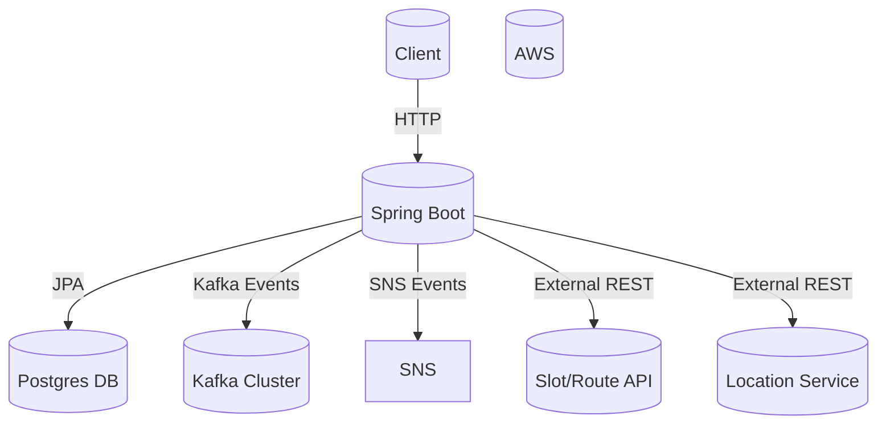
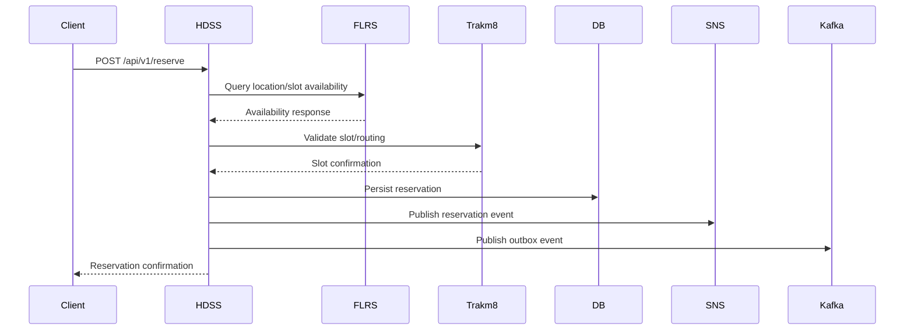

# HDSS Architecture Overview

## Purpose

The Home Delivery Slot Service (HDSS) manages the lifecycle of home delivery slot reservations for Sainsbury’s. It ensures real-time availability, secure booking and releasing, and handles redelivery requests and notifications.

## High-Level Architecture Diagram



## Component Breakdown

- **API Layer**: Exposes REST endpoints for reservation, release, redelivery, and availability.
- **Service Layer**: Handles business logic, caching, and orchestration of external calls.
- **Persistence Layer**: Uses Spring Data to access the Postgres database.
- **Integration Layer**: Connects to Trakm8 and FLRS for slot and location information.
- **Messaging Layer**: Publishes and consumes events via Kafka and AWS SNS/SQS for notifications and downstream processing.
- **Testing Layer**: Uses WireMock, TestContainers, and Groovy/Spock for comprehensive integration and unit tests.

## Sequence Diagram: Reserve Slot



---

````markdown name=API.md
# HDSS API Documentation

## Authentication

All endpoints require an API key via the `Authorization` header:
```
Authorization: egg
```

## Endpoints

### 1. Reserve Slot

**POST /api/v1/reserve**

Reserve a slot for a customer.

#### Request

```json
{
  "address": {
    "fullAddress": "1 May Tree Close, Winchester, UK",
    "latitude": 51.062612784361576,
    "longitude": -1.3289642539861162,
    "postCode": "SO22 4JE"
  },
  "alcoholInBasket": false,
  "customerId": "0c8d0d94-b152-427e-912a-3b0d86a0b267",
  "doorstepTimeSeconds": 180,
  "durationInSeconds": 3600,
  "locations": [
    "U0FJTlNCVVJZU19TVE9SRTplNWQ2ZjYxYi0zNjM1LTQxMWQtOWQ2ZS1mM2NlNTU5MjBlYWI="
  ],
  "orderNumber": "123456789",
  "startDate": "2023-07-13",
  "startTime": "09:00",
  "weightGrams": 2000
}
```

#### Response

```json
{
  "reservationId": "f1ce873f-8103-4b65-94b0-17468751a23f",
  "status": "SUCCESS",
  "details": "Reservation created."
}
```

---

### 2. Release Slot

**POST /api/v1/release**

Release a previously reserved slot.

#### Request

```json
{
  "reservationId": "f1ce873f-8103-4b65-94b0-17468751a23f"
}
```

#### Response

```json
{
  "status": "SUCCESS",
  "details": "Reservation released."
}
```

---

### 3. Redeliver Reservation

**POST /api/v1/redeliver**

Request redelivery for a reservation.

#### Request

```json
{
  "originalReservationId": "f1ce873f-8103-4b65-94b0-17468751a23f",
  "newStartDate": "2023-07-20",
  "newStartTime": "10:00"
}
```

#### Response

```json
{
  "status": "SUCCESS",
  "newReservationId": "b2ce873f-8103-4b65-94b0-17468751a24g"
}
```

---

### 4. Availability Query

**POST /api/v1/availability**

Check available slots for a given location and time window.

#### Request

```json
{
  "address": { ... },
  "startDate": "2023-07-13",
  "endDate": "2023-07-15",
  "locations": [ ... ]
}
```

#### Response

```json
{
  "availableSlots": [
    {
      "date": "2023-07-13",
      "startTime": "09:00",
      "duration": 3600,
      "locationId": "U0FJTlNCVVJZU19TVE9SRTplNWQ2ZjYxYi0zNjM1LTQxMWQtOWQ2ZS1mM2NlNTU5MjBlYWI="
    }
  ]
}
```

---

## Error Responses

All error responses include HTTP status and a `detail` field.

```json
{
  "status": 404,
  "detail": "Reservation not found"
}
```

---

````markdown name=INTEGRATION.md
# Integration Details and Deep Breakdown

## External Integrations

### Trakm8

- Used for slot and route optimization.
- Invoked during reservation and release to validate feasibility and update job data.
- Integration tested via WireMock servers in Groovy/Spock tests.

### FLRS

- Fulfilment Location Reservation Service.
- Used to determine which locations are available for delivery at a given time.
- Queries use GraphQL (`FlrsSameDayAvailabilityCacher.java`).

### Kafka

- Used for publishing events to downstream consumers.
- Notification outbox pattern used for reliability.
- Topics configured for MADE and Confluent clusters.

### SNS/SQS

- Events published for reservation, release, and updates.
- AWS credentials and endpoints configured via environment variables and Spring Boot.

## Testing

- **Integration tests** simulate full flows using WireMock and Docker containers.
- **Unit tests** mock external dependencies and focus on business logic.

## Business Logic Highlights

- **Reservation validation**: Ensures slot is available before booking.
- **Release logic**: Ensures only valid, existing reservations are released.
- **Redelivery**: Re-books or changes the slot for an existing reservation.
- **Caching**: Reduces load on external FLRS service, improves performance.

## Logging & Observability

- Structured logging via Logback and custom utilities (`LogUtils.java`).
- Trace IDs and correlation IDs captured for distributed tracing.
- Metrics published for slot availability and reservation events.

---

For further details, see Groovy integration tests and service classes in `src/main/java/com/sainsburys/psr/hdss/service/`.
